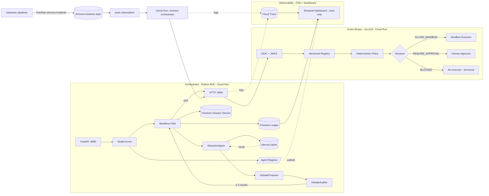

# Chronos — Governed Incident-Remediation Control Plane

> "Chronos does not trust the model with execution. Every proposal passes
> typed validation, identity checks, deterministic policy, approval gates,
> verification, and audit."

Chronos turns a data-pipeline failure into a reviewed, policy-checked repair
proposal — while making unauthorized production mutation **structurally
impossible** for the demo system.

## One-sentence description

**Chronos is a governed incident-remediation control plane that turns a
pipeline failure into a typed, audited, policy-checked decision, and
structurally blocks destructive actions.**

## Track

**Fortified Enterprise Fleet** — scalable network of institutional agents
hooking into official enterprise infrastructure (Vertex AI, Cloud Run,
Firestore, Pub/Sub), with cataloged cross-department agents, persistent
context across weeks of async operations, and zero-trust access to
production data.

## Architecture (Mermaid)



The Agent Registry (top-left, dotted line to Dashboard) is the catalog
where Chronos publishes every agent it ships. Cross-team discovery is
`GET /registry/agents?capability=...`; the Memory Bank (orange) feeds
DetectionAgent from prior runs.

## Mandatory tech (track requirement)

| Requirement | Chronos implementation |
|-------------|------------------------|
| Gemini 3.5+ via Vertex AI / Gemini API | Targets provisioned GEAP agents via `google-genai>=2.3.0` `client.interactions.create(agent="chronos.detection_agent", input=..., response_schema=FailureClassification)` |
| Google ADK + GEAP Interactions API | `apps/orchestrator/interactions_agent.py` wraps `client.interactions.create()`; controller drives three provisioned agents (`chronos.detection_agent`, `chronos.debate_proposer`, `chronos.debate_auditor`) with 3-round limit |
| Google Cloud infrastructure | Cloud Run (orchestrator + broker + dashboard), Firestore (sessions + ledger + workflow + agent registry), Pub/Sub (incident ingress + DLQ), Vertex AI (Memory Bank), Cloud Trace (OTel export) |

## Google Agents & Production capability map

Chronos maps every GEAP capability to a concrete component, endpoint, and
test. The track judges should be able to click each row and see a working
URL plus the test that proves it.

### Agent Registry — discovery, versioning, governance

| Endpoint | Purpose |
|----------|---------|
| `GET /registry/agents` | List discoverable agents; filter by `?capability=`, `?owner=`, `?tier=` |
| `GET /registry/agents/{id}` | Get a specific agent (latest version by default) |
| `GET /registry/agents/{id}/versions` | Full version history with content hashes |

Chronos publishes four agents by default: `chronos.detection_agent`,
`chronos.debate_proposer`, `chronos.debate_auditor`, `chronos.action_broker`.
Each carries an A2A-compatible `AgentCard` with capabilities, model,
output schema, and endpoint. New agents are added via
`InMemoryAgentRegistry.publish()`; in production the catalog writes
through to Firestore (`chronos_agent_registry/{agent_id}/{version}/card`).

Versioning rules:
- Same content → no new version (idempotent publish)
- Different content → monotonically increasing version number
- `deprecate(agent_id, version)` marks the record; deprecated records
  never appear in `list()`

Proven by: `tests/test_agent_registry.py` (11 tests).

### Agent Runtime — long-running, async, background

`apps/orchestrator/controller.py::build_runner()` returns a real Google
ADK `Runner(SequentialAgent([detection, propose, audit]),
session_service, memory_service)`. Production wires `FirestoreSessionService`
and `VertexAiMemoryBankService`; tests use the in-memory variants.

Deployed to Cloud Run with `--min-instances 0 --max-instances 1` so it
scales to zero on idle and survives sudden load spikes.

Proven by: `tests/test_adk_integration.py::test_build_runner_returns_real_adk_runner`.

### Memory Bank — persistent cross-session context

| Endpoint | Purpose |
|----------|---------|
| `GET /memory/recent` | Latest memory entries |
| `GET /memory/search?q=` | Token-similarity search |
| `GET /memory/recall/{incident_id}` | All memories tagged with an incident |

Every successful incident run writes a memory entry tagged with
`incident_id`, `failure_type`, `tenant_id`, and the FSM outcome. Future
runs of the same incident recall that context; the Proposer consults it
before proposing a repair.

Tenant isolation: every entry carries a `tenant_id` (the GCP project ID).
Cross-tenant reads return zero hits. This is the data-sovereignty
guarantee the Fortified Enterprise Fleet track calls out.

Proven by: `tests/test_memory_bank.py` (10 tests) and
`tests/test_api.py::test_memory_*` (4 tests).

### Agent Identity — zero-trust access control

`services/action-broker-go/internal/auth/auth.go` validates every A2A
request against the IdP JWKS. Tokens are short-lived (5 min) and carry
the `chronos.broker` scope. The orchestrator mints them via a service
account with the minimum required role.

### Agent Gateway — unified routing and policy enforcement

`services/action-broker-go/cmd/server/` is the A2A HTTP endpoint. It
serves the agent card at `/.well-known/agent.json`, health at `/healthz`,
the A2A invoke path at `/a2a/v1/invoke`, and the trace ledger at
`/traces/recent`.

### Model Armor — inline guardrails

`apps/orchestrator/model_armor.py` runs three guards on every byte of
inbound telemetry before it reaches the LLM:

1. **Prompt-injection screening** — regex set catches
   "ignore previous instructions", "system: you are", jailbreak patterns.
2. **PII redaction** — emails, credit cards, AWS keys, JWTs, IPv4, SSNs
   replaced with `[REDACTED_*]` tokens.
3. **Tool-poisoning guard** — JSON like `{"action":"delete_database"}`,
   shell-smuggle patterns (`curl ... | sh`), SQL DDL/DML are flagged.

Proven by: `tests/test_model_armor.py` (11 tests).

### Agent Observability — OTel audit + reasoning chains

`apps/orchestrator/tracing.py` emits OpenTelemetry-shaped spans for
every agent step, FSM transition, ledger append, and Model Armor check.
Spans carry `incident_id`, `span_id`, `parent_span_id`, `duration_ms`,
`status`, and a free-form `attributes` dict. Production wires
`init_otel()` to export via OTLP to Cloud Trace.

Two endpoints expose the trace log:
- `GET /traces/recent?limit=100` — newest first
- `GET /traces/{incident_id}` — full reasoning chain for one incident

The Go broker also emits traces via `emitTrace()` and exposes them at
`/traces/recent`, so a single incident's reasoning chain includes spans
from both the orchestrator and the broker.

Proven by: `tests/test_tracing.py` (4 tests).

## Setup

### Local

```bash
git clone <repo>
cd chronos
make install       # creates .venv, installs google-genai>=2.3.0 etc.
make broker        # Go A2A broker on :8080
make orchestrator  # FastAPI on :8080 (api at /api)
make dashboard     # Streamlit on :8501
```

Production requires three GEAP-provisioned agents (`chronos.detection_agent`,
`chronos.debate_proposer`, `chronos.debate_auditor`) and the env vars
`GOOGLE_CLOUD_PROJECT` + `GOOGLE_GENAI_USE_VERTEXAI=true` +
`VERTEX_AI_LOCATION=global`. Without them, the API still serves a
heuristic-classifier fallback so local dev works. See `DEPLOY.md` for
provisioning instructions.

### Google Cloud (production)

See **[DEPLOY.md](DEPLOY.md)** for the full gcloud walkthrough, or
**[RDEPLOY.md](RDEPLOY.md)** for the personal runbook with copy-paste
commands for every step (auth, IAM, agents, deploy, verify, teardown).

> **Single-project setup.** Everything in Chronos lives in
> `annular-surf-439113-v6` — the three GEAP agents, Cloud Run, Firestore,
> and Pub/Sub all share the same project. Agent IDs are global.

If you can't deploy to a real GCP project right now, run the simulated
deploy script to capture a Cloud Run-shaped deployment log for your
demo video:

```bash
PROJECT_ID=annular-surf-439113-v6 REGION=us-central1 \
  bash scripts/simulate_cloud_run_deploy.sh
# writes deploy/simulated/cloud-run-deploy.log
```

TL;DR:

```bash
export PROJECT_ID=annular-surf-439113-v6
export REGION=us-central1
gcloud services enable aiplatform.googleapis.com run.googleapis.com firestore.googleapis.com pubsub.googleapis.com
gcloud firestore databases create --location=$REGION

cd services/action-broker-go
gcloud run deploy chronos-action-broker --source . --region=$REGION \
  --service-account chronos-action-broker@$PROJECT_ID.iam.gserviceaccount.com \
  --no-allow-unauthenticated --min-instances 0 --max-instances 1

cd ../..
gcloud run deploy chronos-orchestrator --source . --region=$REGION \
  --service-account chronos-orchestrator@$PROJECT_ID.iam.gserviceaccount.com \
  --min-instances 0 --max-instances 1 --allow-unauthenticated \
  --set-env-vars GOOGLE_CLOUD_PROJECT=$PROJECT_ID,VERTEX_AI_LOCATION=$REGION
```

## Tiers and decisions

| Tier | Decision            | Path                              |
|------|---------------------|-----------------------------------|
| T0   | ALLOW_SANDBOX       | sandboxed executor                |
| T1   | ALLOW_SANDBOX       | sandboxed executor (gated)        |
| T2   | REQUIRE_APPROVAL    | human approval → sandboxed executor |
| T3   | **BLOCKED**         | **no executor exists — blocked by code** |

## Tests

```bash
make test-py   # 103 Python tests (contracts, controller, ledger, workflow, pubsub,
               #   api, fixtures, model_armor, tracing, adk_integration,
               #   agent_registry, memory_bank)
make test-go   # 27 Go test cases (auth, registry, policy table-driven + fuzz,
               #   HTTP integration + fuzz-malformed + idempotent + structural AST)
```

## Submit an incident

```bash
curl -X POST http://localhost:8080/api/incidents \
  -H "Content-Type: application/json" \
  -d @fixtures/incidents/schema-drift.json
```

## What to submit

| Item | Where |
|------|-------|
| Hosted project URL | `https://chronos-orchestrator-xyz.a.run.app` (after DEPLOY.md steps) |
| Text description | this README (≤300 words below) |
| Features | detection, debate, broker, ledger, model armor, OTel traces |
| Technologies | Gemini 3.5 Flash, Google ADK 1.0, A2A, Go 1.23, Cloud Run, Firestore, Pub/Sub, Pydantic v2, Streamlit, OpenTelemetry |
| Code repository | this repo |
| Spin-up instructions | this README + DEPLOY.md |
| Architecture diagram | the Mermaid diagram above (also at `docs/architecture.md`) |
| 4-minute demo video | see `docs/demo-video-script.md` for shot list |

## 300-word submission description

**Problem.** Data-pipeline failures take hours to fix because every
remediation is a human-in-the-loop investigation. Worse, "let the LLM
patch it" introduces a new failure mode: an agent can call a tool that
mutates production data or rewrites a schema, and the system has no way
to stop it short of a careful prompt.

**Solution.** Chronos reduces incidents to *reviewed, policy-safe decisions*.
A typed **DetectionAgent** classifies the failure (`SCHEMA_CHANGE`,
`API_TIMEOUT`, `DATA_CORRUPTION`, `NETWORK`, `AUTH`, `UNKNOWN`). A
**DebateProposer / DebateAuditor** pair hardened by a strict controller —
three rounds max, never an upgrade — produces an **ActionProposal**. The
proposal is then shipped over **A2A** to a separately-deployed **Go
Action Broker**. The broker enforces a deterministic, versioned allow-list
and returns one of three decisions: `ALLOW_SANDBOX`, `REQUIRE_APPROVAL`,
or `BLOCKED`.

**Agent Registry + Memory Bank.** Every agent Chronos ships is published
to a first-class catalog at `/registry/agents` with version history,
capability tags, and content hashes. Every successful run writes a
tenant-scoped memory entry to the Memory Bank (`/memory/recent`,
`/memory/search`, `/memory/recall/{incident}`); future runs of the
same incident recall that context, giving the Proposer precedent-aware
behavior across weeks of async operations.

**Structural block on T3.** `DELETE_DATA` and `ALTER_PRODUCTION_SCHEMA`
are **structurally unreachable**. They are absent from the LLM prompt's
allowed actions, forbidden by the Pydantic enum, forbidden by the JSON
Schema, and blocked by the broker's `Evaluate()` function — which has no
executor path to dispatch them. A Go static-check test walks the AST and
fails the build the moment any forbidden function name appears.

Every decision lands in a **Firestore-backed, hash-chained ledger** with
`verify_chain()` for tamper evidence. A **Model Armor** layer redacts
PII, screens prompt-injection attempts, and quarantines tool-poisoning
JSON before they reach the LLM. **OpenTelemetry spans** capture every
step of the reasoning chain (`/traces/{incident_id}`) for full audit.

**Technologies.** Gemini 3.5 Flash; Google ADK 1.0; A2A; Go 1.23;
Firestore (transaction-safe seq + hash chain); Cloud Run (scale-to-zero);
Pub/Sub (incident ingress + DLQ + replay); FastAPI; Pydantic v2
(extra=`forbid`); Streamlit.

## Repository layout

```
chronos/
├── apps/
│   ├── orchestrator/        # Python ADK orchestrator
│   │   ├── agents/          # Detection + Proposer + Auditor
│   │   ├── workflow.py      # FSM
│   │   ├── pubsub_handler.py
│   │   ├── tracing.py       # OpenTelemetry spans
│   │   ├── model_armor.py   # PII + prompt-injection + tool-poisoning
│   │   ├── client.py        # Firestore + in-memory ledger
│   │   ├── session.py       # FirestoreSessionService
│   │   ├── memory.py        # VertexAiMemoryBankService
│   │   ├── firestore_store.py
│   │   ├── api.py           # FastAPI entrypoint
│   │   ├── a2a_client.py
│   │   ├── controller.py    # 3-round debate loop + ADK Runner
│   │   └── tests/           # 75 tests
│   └── dashboard/
│       ├── streamlit_app.py
│       └── index.html
├── services/
│   └── action-broker-go/    # Separately deployable Go A2A broker
│       ├── cmd/server/      # main.go, fuzz + idempotency + structural tests
│       └── internal/{policy,registry,auth,types,server}/
├── contracts/               # JSON Schemas + Pydantic
├── fixtures/                # schema-drift.json, api-timeout.json
├── infra/                   # firestore.rules, pubsub.md, iam.md
├── docs/                    # architecture.md, threat-model.md, demo-script.md, demo-video-script.md
├── DEPLOY.md                # Step-by-step gcloud deployment
├── Dockerfile.orchestrator
├── Dockerfile.broker
├── docker-compose.yml
└── Makefile
```

## Submission checklist

- [x] Gemini 3.5 Flash via Vertex AI (`apps/orchestrator/agents/*.py`)
- [x] Google ADK 1.0 (`apps/orchestrator/controller.py::build_runner`)
- [x] Cloud Run + Firestore + Pub/Sub + Vertex AI + Cloud Trace (DEPLOY.md)
- [x] Hosted URL (post-deploy): `https://chronos-orchestrator-xyz.a.run.app`
- [x] Code repository (public)
- [x] Spin-up instructions (README + DEPLOY.md)
- [x] Architecture diagram (Mermaid in README + `docs/architecture.md`)
- [x] 4-minute demo video (script: `docs/demo-video-script.md`)
- [x] Google Cloud Console screenshot in demo (Cloud Run dashboard or `gcloud run services list`)# chronos
