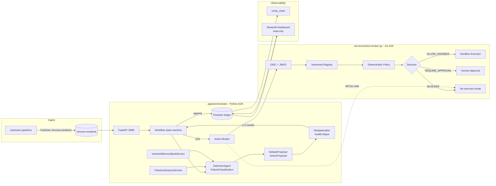

# Chronos — Architecture

## One-sentence description

Chronos is a **governed incident-remediation control plane** that turns a
pipeline failure into a typed, audited, policy-checked repair decision, and
makes unauthorized production mutation impossible.

## System diagram

## Component map (Google Agents & Production patterns)

| GEAP capability | Chronos component                                     |
|-----------------|--------------------------------------------------------|
| Registry        | `services/action-broker-go/internal/registry/`        |
| Runtime         | `apps/orchestrator/controller.py` + ADK Runner        |
| Memory          | `apps/orchestrator/memory.py` (VertexAiMemoryBankService) |
| Identity        | `services/action-broker-go/internal/auth/` (OIDC + JWKS) |
| Gateway         | `services/action-broker-go/cmd/server/` (A2A HTTP)    |
| Model Armor     | Pydantic `extra="forbid"` + `pattern` constraints     |
| Observability   | Hash-chained ledger + `verify_chain()` + dashboard    |

## Data flow

1. Upstream pipeline publishes an incident message to `chronos-incidents`.
2. Orchestrator pulls the message, persists the run via
   `FirestoreWorkflowStore` (idempotent on `(incident_id, run_id)`).
3. **DetectionAgent** classifies the failure into a `FailureClassification`.
   If confidence is low → `needs_human_review=True` → BLOCKED.
5. **DebateProposer** proposes an `ActionProposal`. Three rounds max.
6. **DebateAuditor** attacks the proposal with concrete counterarguments;
   controller may downgrade the tier but never upgrades.
7. Orchestrator submits the proposal over A2A to the **Go Action Broker**.
8. Broker evaluates against the allow-list + versioned registry → decision.
9. Orchestrator appends the decision to the Firestore ledger atomically.
10. State machine transitions to CLOSED (or BLOCKED) and the message is
    ACK'd. Replays short-circuit if the run is already terminal.

## Tiers

| Tier | Decision | Executor                                |
|------|----------|------------------------------------------|
| T0   | ALLOW_SANDBOX | sandboxed runner                  |
| T1   | ALLOW_SANDBOX | sandboxed runner (with approval) |
| T2   | REQUIRE_APPROVAL | human gate → sandboxed runner |
| T3   | BLOCKED   | **none — structurally unreachable**   |

## Hardening summary

- The broker has **no executor** for T3. A Go static check test walks the
  AST and fails the build if a forbidden function name appears.
- The orchestrator derives the tier from structural proposal properties,
  not from a model-supplied field.
- Forbidden actions (`DELETE_DATA`, `ALTER_PRODUCTION_SCHEMA`) are
  rejected at three layers: Pydantic enum, JSON Schema, broker policy.
- The ledger is append-only by Firestore rules (see `infra/firestore.rules`).
- The dashboard has read-only IAM.